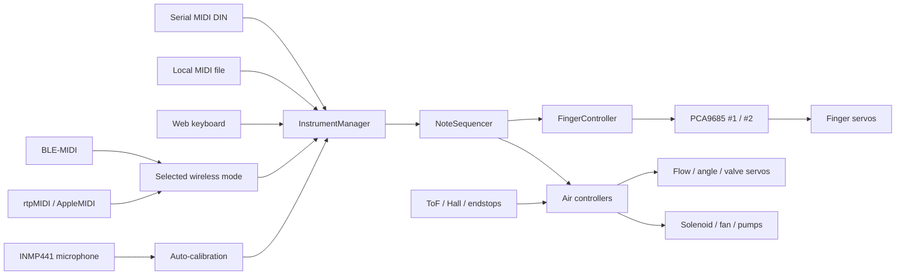

# Servo Flute GMB

**Modular ESP32 controller for robotic flutes and simple wind instruments.**

Servo Flute GMB converts a recorder, tin whistle, ocarina, Native American flute, transverse flute, bansuri, shakuhachi, ney, kaval, or similar instrument into a MIDI-controlled robotic instrument.

Finger count, servo channels, fingering tables, airflow behavior, MIDI settings, and calibration values are configured at runtime from the embedded web interface. Recompiling the firmware is not required for normal instrument setup.

> [!IMPORTANT]
> **Project status:** the firmware builds and its software behavior is covered by automated tests. Physical validation is still in progress. Hardware-dependent features remain marked **NOT TESTED — requires hardware** until verified on the corresponding ESP32, PCA9685, servos, valves, pumps, fans, sensors, microphone, and instrument.

> [!WARNING]
> This project controls mechanical and pneumatic actuators. Use a separate fused actuator supply, a common ground, proper flyback protection for inductive loads, and a physical emergency-stop or power-disconnect method. Operate the web interface only on a trusted network.

## What the project provides

- Up to **31 finger servos** using one or two PCA9685 boards
- Runtime-configurable finger count, PCA channels, servo direction, closed angle, and half-hole position
- Instrument presets and fully editable MIDI fingering tables
- Six modular air-management modes
- BLE-MIDI, rtpMIDI/AppleMIDI, serial MIDI DIN, virtual keyboard, and local MIDI-file playback
- Embedded responsive web interface for configuration, tests, monitoring, and calibration
- Optional INMP441 microphone auto-calibration
- Per-note minimum, nominal, and maximum airflow values
- Persistent JSON configuration stored in LittleFS
- Safe boot ordering, centralized configuration validation, watchdog handling, actuator-test timeouts, and panic behavior

## Supported instrument scope

This firmware targets wind instruments whose pitch can be controlled mainly by closing holes and adjusting airflow:

- recorder and tin whistle;
- Native American flute;
- ocarina and tabor pipe;
- transverse flute, bansuri, dizi, and fife;
- shakuhachi, ney, kaval, and similar end-blown flutes.

Reed and lip-buzzing instruments such as clarinet, saxophone, trumpet, and trombone are outside the current scope because they require additional embouchure control.

## System overview



The physical switch selects **BLE mode or Wi-Fi mode**. Serial MIDI can remain available independently when enabled. BLE-MIDI and rtpMIDI are therefore not both active through the selected wireless mode at the same time.

## Recommended first build

Start with the smallest reproducible configuration before adding pumps, reservoirs, sensors, or automatic calibration.

| Component | Quantity | Purpose |
|---|---:|---|
| ESP32-WROOM development board | 1 | Main controller |
| PCA9685 | 1 | Servo PWM controller |
| SG90-class servos | 7 | Six fingers and one airflow servo |
| Regulated 5 V servo supply | 1 | Separate actuator power |
| Bulk capacitor near PCA9685 V+ | 1 | Limits voltage dips caused by servos |
| Air valve or airflow mechanism | 1 | Starts and stops the note |
| Logic-level MOSFET driver | 1 | Required for a solenoid or DC load |
| Flyback diode | 1 | Required across an inductive load |
| Fuse or resettable protection | 1 | Actuator-supply protection |
| BLE/Wi-Fi selector switch | 1 | Connected to GPIO4 |
| INMP441 microphone | Optional | Automatic pitch/airflow calibration |

### Power rules

- Do not power multiple servos from the ESP32 5 V pin.
- Power the PCA9685 servo rail from a dedicated regulated supply.
- Connect ESP32 ground, PCA9685 ground, servo-supply ground, and driver ground together.
- Size the supply for servo startup and stall current, not only average current.
- Add a fuse and a physical way to remove actuator power.
- Use a MOSFET and flyback diode for solenoids, pumps, relays, and other inductive loads.

## Default wiring

| Function | ESP32 pin / bus |
|---|---|
| Status LED | GPIO2 |
| BOOT / pairing button | GPIO0 |
| BLE/Wi-Fi selector | GPIO4 |
| PCA9685 output enable | GPIO5 |
| I2C SDA | GPIO21 |
| I2C SCL | GPIO22 |
| Default solenoid output | GPIO13 |
| INMP441 BCLK | GPIO14 |
| INMP441 WS / LRCLK | GPIO15 |
| INMP441 data | GPIO32 |

The default PCA9685 addresses are:

- board 1: `0x40`, global channels `0-15`;
- board 2: `0x41`, global channels `16-31`.

The second board is required only when the configuration uses channel 16 or above. Solder the appropriate address jumper on the second PCA9685 before connecting it.

Detailed pin and parameter information: [Configuration](docs/CONFIGURATION.md) and [PCA9685 expansion](docs/PCA9685_EXPANSION.md).

## Air-management modes

| Mode | Architecture | Typical use |
|---:|---|---|
| 0 | Solenoid + flow servo | Simple compressed-air or blower source |
| 1 | Servo valve + flow servo | Fully servo-operated valve system |
| 2 | Flow servo only | Minimal mechanism where the servo also stops airflow |
| 3 | Fan + flow servo | Continuous low-pressure blower |
| 4 | One to three pumps + valve | Direct pump supply without reservoir |
| 5 | Pumps + reservoir + valve | Regulated stored-air system with sensor feedback |

The web interface displays only the controls relevant to the selected mode. See [Air management](docs/AIR_MANAGEMENT.md).

## MIDI and control paths

| Input | Availability | Typical source |
|---|---|---|
| BLE-MIDI | Bluetooth switch position | Phone, tablet, computer |
| rtpMIDI / AppleMIDI | Wi-Fi switch position | DAW on the local network |
| Serial MIDI DIN | Optional, independently enabled | Hardware MIDI controller |
| Web keyboard | Wi-Fi mode | Browser |
| MIDI file | Wi-Fi mode, stored in LittleFS | Autonomous playback |

All accepted events converge on the same monophonic `InstrumentManager` and `NoteSequencer` path so finger positioning, airflow timing, replacement notes, note-off handling, and panic behavior use the same logic.

## Web interface

The ESP32 embeds a responsive single-page application. No external server is required.

| Section | Function |
|---|---|
| **Keyboard** | Play configured notes and view hole and airflow states |
| **MIDI** | Upload, select, and play SMF Type 0/1 MIDI files |
| **Air** | Configure and monitor the selected pneumatic architecture |
| **Calibration** | Configure fingers, fingerings, breath, and expression |
| **Settings** | Instrument, MIDI, Wi-Fi, hardware, and persistent configuration |

The Air tab is shown only when relevant to the selected configuration.

REST endpoints and WebSocket messages are documented in [Web API](docs/API_WEB.md).

## Installation with PlatformIO

PlatformIO is the recommended build method because the repository already pins the target platform, partition layout, and library versions.

### Requirements

- Git
- Visual Studio Code with PlatformIO, or PlatformIO Core
- ESP32-WROOM-compatible development board
- USB data cable

### Build and upload

```bash
git clone https://github.com/glloq/Servo-Flute-GMB.git
cd Servo-Flute-GMB

pio run
pio run --target upload
pio device monitor
```

The project uses a custom 4 MB partition layout because the complete firmware, embedded web application, BLE, Wi-Fi, MIDI, and calibration code exceed the default ESP32 application partition.

To run the host-side native tests:

```bash
pio test -e native
```

The exact dependencies and versions are listed in [`platformio.ini`](platformio.ini).

## First start

1. Flash the firmware and restart the ESP32.
2. Put the selector in Wi-Fi mode.
3. On first boot, connect to the `ServoFlute-Setup` access point.
4. Open the captive portal; if it does not appear automatically, open `192.168.4.1`.
5. Select an instrument preset or define the finger count and embouchure type.
6. Configure the PCA9685 channel used by each servo.
7. Calibrate the closed position and direction of every finger.
8. Configure or verify the fingering table.
9. Select the air-management mode and test each actuator individually.
10. Set per-note airflow values manually or use microphone auto-calibration.
11. Save the configuration and restart when the interface reports `restart_required`.
12. Connect a MIDI source and test at low actuator power before full operation.

When station credentials are saved, the interface is normally available through `servo-flute.local` or the IP address displayed by the device.

## Physical controls

### BLE/Wi-Fi selector — GPIO4

| Position | Active wireless mode |
|---|---|
| LOW | BLE-MIDI |
| HIGH | Wi-Fi, rtpMIDI, web interface |

### BOOT button — GPIO0

| Action | Effect |
|---|---|
| Short press | Restart BLE advertising or display the Wi-Fi IP address |
| Double press within 500 ms | Open all fingers, unless an actuator session owns the hardware |
| Long press for 3 seconds | Force Wi-Fi access-point mode |

## Optional microphone auto-calibration

An INMP441 I2S microphone can measure the sounding result while the firmware sweeps airflow. For each note, the calibration system can determine:

- minimum usable airflow;
- recommended nominal airflow;
- maximum airflow before instability or overblow;
- confidence, tuning error, stability, and signal-to-noise information.

The software pipeline is covered by host tests, but physical microphone and flute validation is still required. See [Auto-calibration](docs/AUTO_CALIBRATION.md).

## Project status

| Area | Status |
|---|---|
| ESP32 firmware build | Automated build available |
| Native behavior tests | Implemented |
| Embedded web application | Implemented |
| Configuration validation | Implemented |
| BLE / Wi-Fi / serial MIDI paths | Implemented in software |
| Local MIDI-file playback | Implemented in software |
| Safe boot and actuator-test timeout logic | Implemented and regression-tested |
| Physical PCA9685 and servo validation | Requires hardware |
| Pump, fan, valve, and sensor validation | Requires hardware |
| INMP441 calibration validation | Requires hardware |
| Network authentication | Not implemented |

Detailed audit findings and the physical test matrix are maintained in [Project status](docs/STATUS.md).

## Security limitation

The current REST API and WebSocket interface are unauthenticated. Anyone who can reach the ESP32 on the network may be able to move actuators, run tests, modify configuration, restart the controller, and manage MIDI files.

Until authentication is implemented:

- set a non-empty access-point password;
- use a private, trusted network;
- do not expose the ESP32 to the Internet;
- do not use port forwarding or an unauthenticated reverse proxy;
- disconnect actuator power when the system is unattended.

See [Access model and known security limitation](docs/API_WEB.md#access-model-and-known-security-limitation).

## Documentation

| Document | Description |
|---|---|
| [Getting started / this README](README.md) | Project overview and first build |
| [Architecture](docs/ARCHITECTURE.md) | Firmware modules and data flow |
| [Air management](docs/AIR_MANAGEMENT.md) | Air modes, pumps, fans, reservoir, and sensors |
| [Web API](docs/API_WEB.md) | REST endpoints and WebSocket protocol |
| [Auto-calibration](docs/AUTO_CALIBRATION.md) | INMP441 pitch and airflow calibration |
| [Calibration](docs/CALIBRATION.md) | Manual instrument calibration workflow |
| [Configuration](docs/CONFIGURATION.md) | Runtime parameters and persistence |
| [PCA9685 expansion](docs/PCA9685_EXPANSION.md) | Second board and global channel mapping |
| [Wi-Fi modes](docs/WIFI_MODES.md) | BLE selection, station mode, and access point |
| [Serial MIDI](docs/MIDI_SERIAL.md) | MIDI DIN input and optocoupler wiring |
| [Servo mounting](docs/SERVO_ANGLE.md) | Mechanical setup for transverse flutes |
| [Project status](docs/STATUS.md) | Validation status, limitations, and test references |

## Planned visuals

The following repository-native visuals should be added as real hardware and CAD material becomes available:

- complete instrument hero photograph or CAD render;
- minimal electrical wiring diagram;
- finger mechanism in open, half-open, and closed positions;
- six air-mode diagrams;
- screenshots of Keyboard, Calibration, and Air pages;
- short demonstration video or animated preview.

Recommended location: `docs/assets/`.

## Project structure

```text
Servo-Flute-GMB/
├── README.md
├── LICENSE
├── platformio.ini
├── docs/
│   ├── ARCHITECTURE.md
│   ├── AIR_MANAGEMENT.md
│   ├── API_WEB.md
│   ├── AUTO_CALIBRATION.md
│   ├── CALIBRATION.md
│   ├── CONFIGURATION.md
│   ├── PCA9685_EXPANSION.md
│   ├── SERVO_ANGLE.md
│   ├── STATUS.md
│   └── WIFI_MODES.md
├── Servo_flute_ESP32/
│   ├── Servo_flute_ESP32.ino
│   ├── settings.h
│   └── firmware modules
└── tests/
```

## Contributing

Issues and pull requests should include:

- the instrument and air mode used;
- ESP32 board and PCA9685 count;
- relevant configuration values;
- exact reproduction steps;
- serial logs when applicable;
- whether the result was tested on physical hardware or only in software.

Do not report a physical test as passed unless it was executed on the corresponding hardware.

## License

This project is licensed under the [MIT License](LICENSE).
